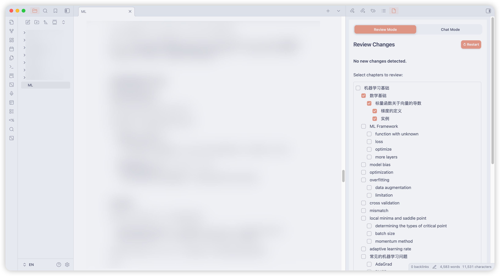
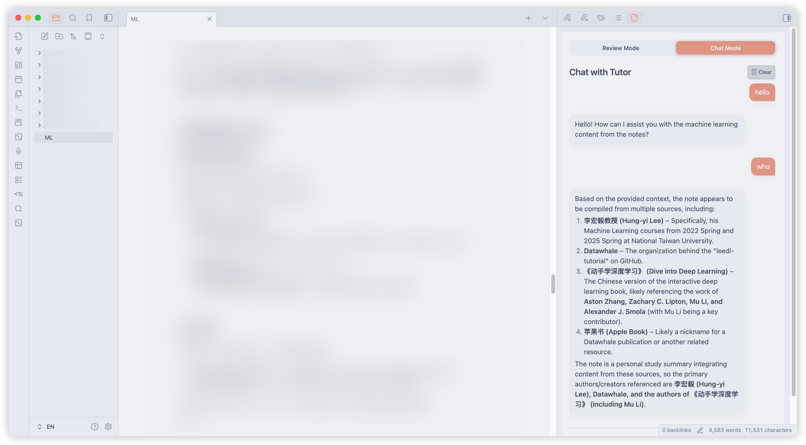

# Obsidian Tutor

[English](#english) | [中文](#中文)

**Obsidian Tutor** is an intelligent review assistant plugin for Obsidian, powered by Large Language Models (LLMs). It helps you actively review your notes, test your understanding, and chat with your knowledge base.

To use this plugin, you need an API key compatible with the OpenAI API format (e.g., OpenAI, DeepSeek, etc.).

---

## English

### Features

*   **🧠 Intelligent Review**:
    *   **Incremental Review**: Automatically detects changes in your notes since the last review and generates quiz questions based *only* on the new content.
    *   **General Review**: If no changes are detected (or whenever you want to review old material), you can select specific chapters/headings to generate a targeted review quiz.
    *   **AI Evaluation**: Your answers are evaluated by AI, providing scores and corrections based strictly on your note content.
*   **💬 Chat with Note**:
    *   Context-aware chat interface.
    *   Ask questions about the current active note, and the AI answers using the note content as context.
    *   Supports Markdown rendering in chat bubbles.
*   **🌍 Multi-language Support**:
    *   Full support for English and Chinese (UI and AI responses).

### Screenshots

| Review Mode | Chat Mode |
|Data | Data | 
| :---: | :---: |
|  |  |

### Configuration

1.  Go to **Settings** > **Tutor**.
2.  **API Key**: Enter your OpenAI (or compatible, e.g., DeepSeek) API Key.
3.  **API Base URL**: Set the base URL (default: `https://api.deepseek.com/v1`).
4.  **Model Name**: Specify the model (default: `deepseek-chat`).
5.  **Language**: Choose between English and Chinese.

---

## 中文

**Obsidian Tutor** 是一款基于大语言模型（LLM）的智能复习助手插件。它能帮助您主动复习笔记，测试理解程度，并与您的知识库进行对话。

使用本插件需要您提供兼容 OpenAI 格式的 API Key（如 OpenAI, DeepSeek 等）。

### 功能特点

*   **🧠 智能复习**：
    *   **增量复习**：自动检测自上次复习以来笔记的变更（Diff），仅针对新内容生成测试题，帮助您巩固新知识。
    *   **章节复习**：如果未检测到变更，或者您想复习旧知识，可以手动勾选特定的章节/标题，生成针对性的复习测验。
    *   **AI 评分**：AI 将严格基于笔记原文评估您的答案，并提供评分和纠正建议，防止幻觉。
*   **💬 笔记对话**：
    *   具备上下文感知的聊天界面。
    *   针对当前打开的笔记提问，AI 会引用笔记内容进行回答。
    *   支持 Markdown 渲染。
*   **🌍 多语言支持**：
    *   完美支持中文和英文的界面及 AI 回复。

### 截图展示

| 复习模式 | 聊天模式 |
| :---: | :---: |
|  |  |

### 配置说明

1.  进入 **设置 (Settings)** > **Tutor**。
2.  **API Key**：输入您的 OpenAI（或兼容接口，如 DeepSeek）API Key。
3.  **API Base URL**：设置接口地址（默认：`https://api.deepseek.com/v1`）。
4.  **Model Name**：指定模型名称（默认：`deepseek-chat`）。
5.  **Language**：选择界面语言（支持中文和英文）。

---

## Installation / 安装

### Manual Install / 手动安装
1.  Download `main.js`, `manifest.json`, `styles.css` from the [Releases](../../releases) page.
2.  Create a folder `obsidian-tutor` inside your vault's `.obsidian/plugins/` directory.
3.  Move the downloaded files into that folder.
4.  Reload Obsidian and enable the plugin.

### Community Install (Coming Soon)
Once approved, you can search for "Tutor" in the Obsidian Community Plugins settings.

## Development

1.  Clone this repository.
2.  Run `npm install`.
3.  Run `npm run dev` to start the file watcher/builder.

## License

MIT
